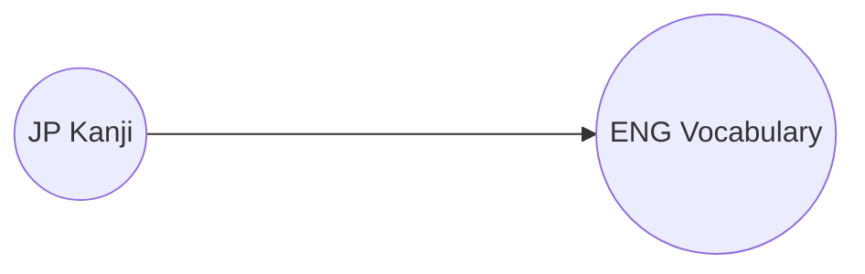
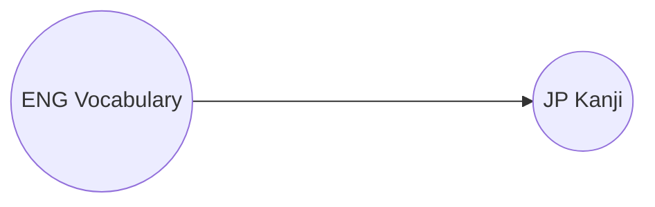

# Welcome to WaniMoreKani
WaniMoreKani is a learning system for Japanese kanji. It acts as an extension to WaniKani, allowing you to solidify your Japanese vocabulary in new ways.

## What's the difference?

### WaniKani
WaniKani focuses on teaching the mapping of kanji to their english meaning. They combine the kanji in a coherent system so that you can identify groups of written kanji as vocabulary. In other words, you enhance your ability to read Japanese. 

### WaniMoreKani
WaniMoreKani focuses on other mappings which help for speaking and comprehension. For instance, given a vocabulary word in your native language, are you able to find a matching word in Japanese?

